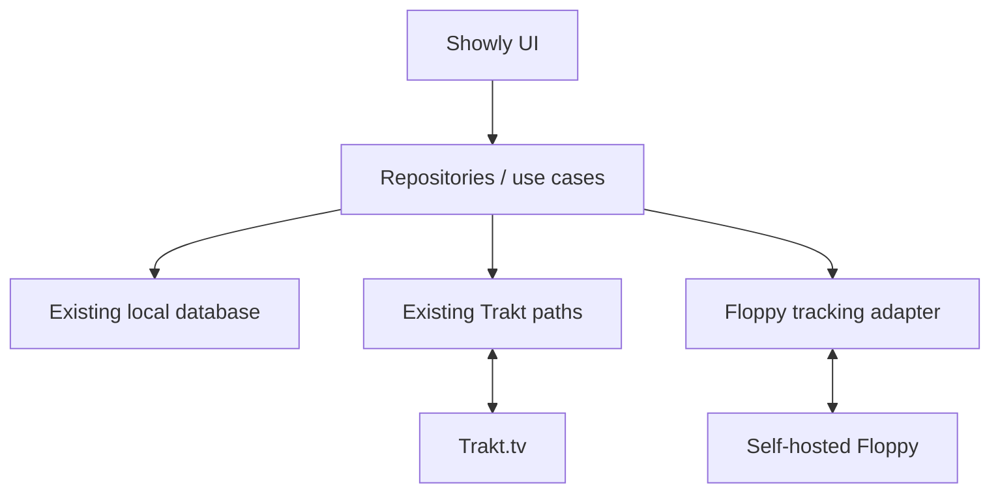

# Architecture

## Baseline

Fork baseline: trakt/showly master at ec897b65b1b55c18ce24a755f83f894f422e559a.

Showly is deeply Trakt-oriented: Trakt supplies catalog data as well as user tracking, the Room schema is keyed heavily by Trakt IDs, and existing sync queues/logs encode Trakt concepts. This fork therefore keeps stable Trakt behavior and adds Floppy at an isolated boundary.

## Target



Trakt remains a first-class backend using the fork-owned OAuth application. Floppy is optional and must never make local/Trakt operations fail when the self-hosted server is offline.

## S1 connection boundary

S1 intentionally avoids a dynamic Retrofit framework. Floppy has a user-configured base URL, so the connection probe uses the existing base OkHttp client with absolute URLs:

1. GET /api/v1/info/ verifies that the configured service is reachable.
2. GET /api/v1/user/preferences/ with X-API-Key verifies the user API key.

The base OkHttp client has no debug BODY logging interceptor, so the Floppy API key is not emitted to logs. Runtime configuration is stored in the existing network SharedPreferences model; no Floppy credential belongs in source control or CI.

## Media identity strategy

The early local database continues to use Trakt IDs. Integration-facing code must carry richer external identity:

```text
MediaIdentity
- traktId?  (legacy/current local key)
- tmdbId?
- tvdbId?
- imdbId?
- mediaType
- season? / episode?
```

Floppy requests should prefer TMDB for movies/shows, retain TVDB/IMDb fallbacks, and identify episodes by parent show plus season/episode when necessary. Floppy internal database IDs must never become Showly's canonical identity.

## Sync direction

The first write slice will be explicit:

1. Existing Showly/Trakt sync refreshes local state.
2. A Floppy adapter reads the relevant local change/state.
3. The adapter writes the equivalent Floppy operation using external IDs.
4. Failures are retryable and observable without rolling back the local or Trakt action.

Two-way synchronization is deferred until timestamp, deletion, conflict, and duplicate-history semantics are specified.

## Build architecture

GitHub is the source of truth. GitHub Actions is the canonical build and verification environment. Local workspaces are not required for this fork's development workflow.
