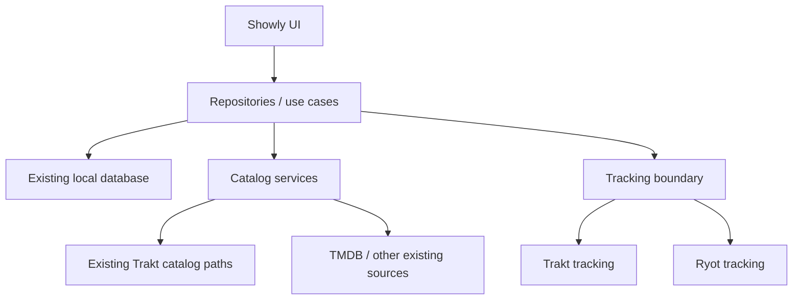

# Architecture

## Baseline

Fork baseline: `trakt/showly` `master` at `ec897b65b1b55c18ce24a755f83f894f422e559a`.

Showly is already split into `data-local`, `data-remote`, `repository`, UI feature modules, and dedicated Trakt sync code. That modularity is useful, but the current boundary is not simply "metadata vs tracking".

### Current observations

- `TraktRemoteDataSource` supplies substantial catalog functionality: shows, movies, seasons, discovery feeds, related media, comments, people credits, search, translations and authentication.
- `AuthorizedTraktRemoteDataSource` owns user-specific operations: profile, history, watched state, watchlist, lists, ratings, hidden/dropped items and comments.
- `UserTraktManager`, `TraktSyncRunner`, `ui-trakt-sync`, settings screens and multiple UI helpers are explicitly Trakt-oriented.
- The local data model is deeply keyed by Trakt IDs. Examples include `IdTrakt`, `fromTraktId`, `getAllTraktIds`, and local watchlist/my-show records keyed by a Trakt ID.
- Existing Trakt sync queue/log tables also encode provider-specific naming.

This means replacing Trakt with Ryot in one pass would combine an API migration, local database identity migration, catalog migration and UI refactor. S0 explicitly rejects that approach.

## Staged target



The diagram is an intended direction, not a claim that the current code already has these interfaces.

## Integration boundary

Introduce provider-neutral concepts only where they reduce coupling. A tentative boundary is:

```kotlin
interface TrackingProvider {
  suspend fun validateConnection(): TrackingAccount
  suspend fun addHistory(items: List<TrackingItem>)
  suspend fun removeHistory(items: List<TrackingItem>)
  suspend fun getHistory(...): List<TrackingHistoryItem>
  suspend fun addWatchlist(items: List<TrackingItem>)
  suspend fun removeWatchlist(items: List<TrackingItem>)
  suspend fun setRating(item: TrackingItem, rating: Int)
}
```

The exact shape must follow real Showly call sites and Ryot capabilities; do not introduce an abstract framework before a vertical slice proves it useful.

## Media identity strategy

The existing local database continues to use Trakt IDs during the early Ryot stages. New integration-facing code should carry a richer identity object:

```text
MediaIdentity
- traktId?   (legacy/current local key)
- tmdbId?
- tvdbId?
- imdbId?
- mediaType
- season? / episode?
```

Rules:

- Never make a Ryot internal metadata/database ID the canonical Showly identity.
- Prefer TMDB for movie/show matching when available; retain TVDB/IMDb as fallbacks.
- Episode identity must include the parent show identity plus season/episode coordinates when an episode-specific external ID is unavailable.
- A future local-database identity migration, if still desirable, gets its own schema design, migrations, rollback plan and tests.

## Sync direction

Early stages should be explicit rather than magical:

1. Existing Showly local mutation occurs.
2. Existing Trakt behavior remains unchanged unless the user changes settings.
3. When Ryot is enabled for a supported operation, an isolated Ryot adapter mirrors or reads that tracking state.
4. Conflict resolution is added only after both read and write paths are verified.

Do not silently make two remote systems mutually authoritative. A later milestone must define per-provider source-of-truth rules and timestamps.

## Build architecture

GitHub is the source of truth. Local clones may be used as disposable editing/debug clients, but reproducibility is defined by GitHub Actions. The upstream Android workflow currently decrypts repository secrets, so a fork-safe CI workflow must be established before relying on it for release artifacts.
